---
## Author
author:
  name: Никуленков Степан
  degrees: DSc
  orcid: 0000-0002-0877-7063
  email: kulyabov-ds@rudn.ru
  affiliation:
    - name: Российский университет дружбы народов
      country: Российская Федерация
      postal-code: 117198
      city: Москва
      address: ул. Миклухо-Маклая, д. 6

## Title
title: "Основы информационной безопасности"
subtitle: "Лабораторная работа №1"
license: "CC BY"
---

# Цель работы

Целью данной работы является приобретение практических навыков
установки операционной системы на виртуальную машину, настройки ми-
нимально необходимых для дальнейшей работы сервисов.

# Задание

1. Установка и настройка операционной системы.
2. Найти следующую информацию:
	1. Версия ядра Linux (Linux version).
	2. Частота процессора (Detected Mhz processor).
	3. Модель процессора (CPU0).
	4. Объем доступной оперативной памяти (Memory available).
	5. Тип обнаруженного гипервизора (Hypervisor detected).
	6. Тип файловой системы корневого раздела.

# Выполнение лабораторной работы

Я выполняю лабораторную работу на домашнем оборудовании, поэтому создаю новую виртуальную машину в VirtualBox, выбираю имя, местоположение  и образ ISO, устанавливать будем операционную систему Rocku DVD

Предварительно выбираю имя пользователя и имя хоста (рис. 1).

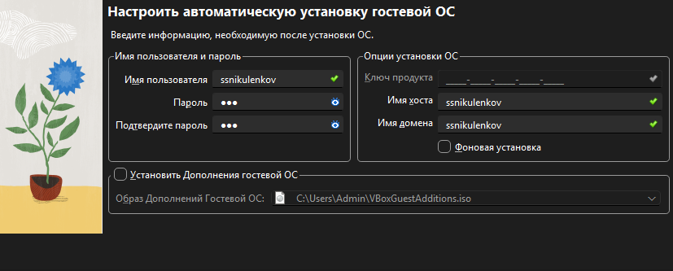{#fig:001 width=70%}

Выставляю основной памяти размер 2048 Мб, выбираю 4 процессора, чтобы ничего не висло (рис. 2).

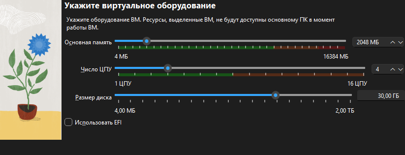{#fig:002 width=70%}

Выделаю 30 Гб памяти на виртуальном жестком диске (рис. 3).

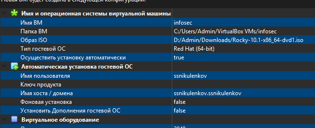{#fig:003 width=70%}

Начинается загрузка операционной системы (рис. 4).

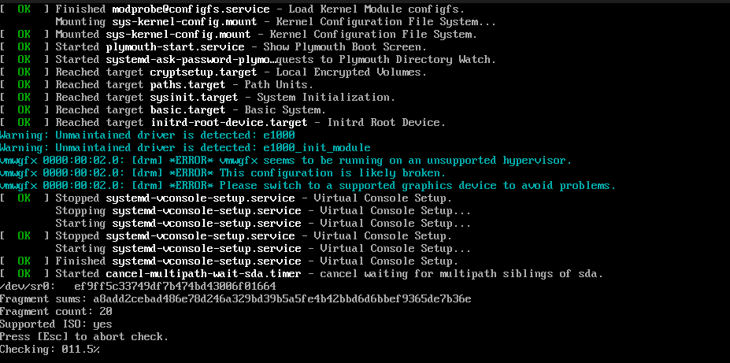{#fig:004 width=70%}

Выбираю язык установки (рис. 5).

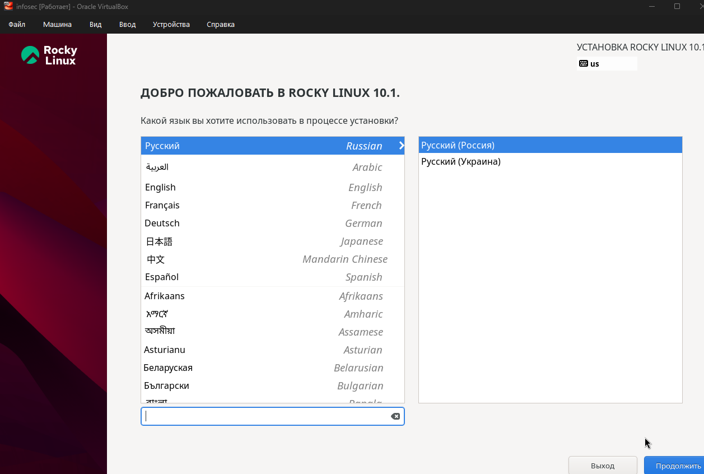{#fig:005 width=70%}

В обзоре установки будем проверять все настройки и менять на нужные.Язык раскладки должен быть русский и английский.

Установил пароль для администратора (рис. 6).

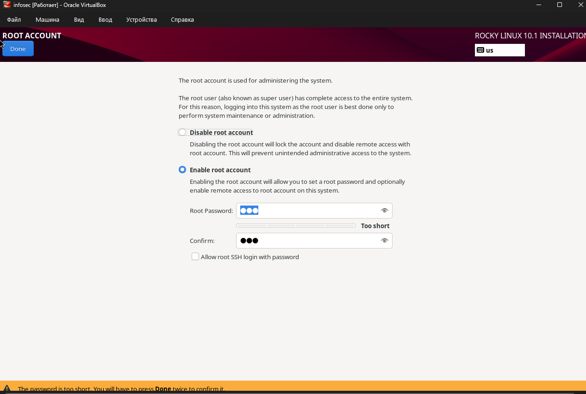{#fig:006 width=70%}

Для пользователя так же сделала пароль и сделала этого пользователя администратором .

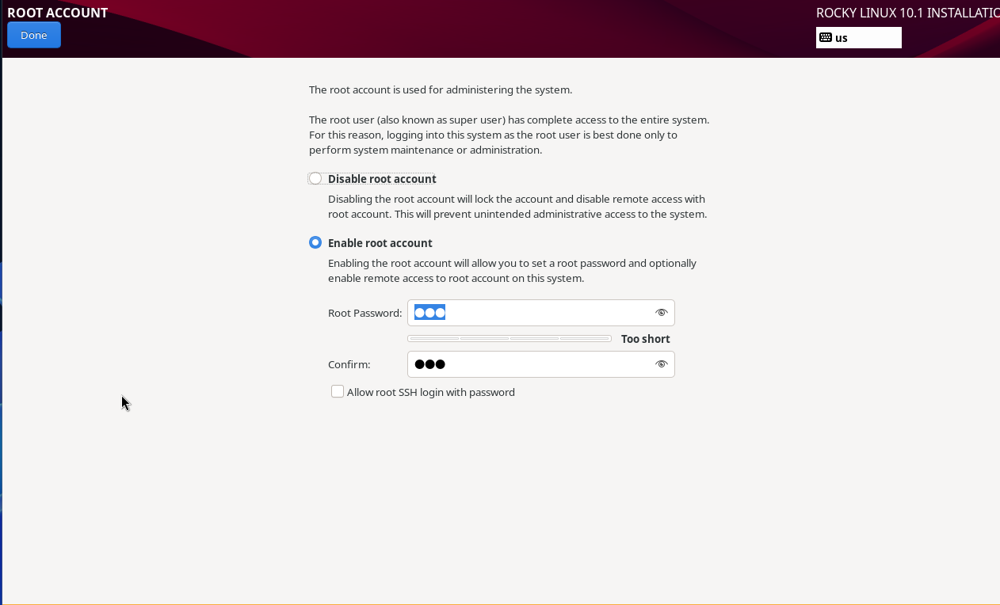{#fig:007 width=70%}

В соответствии с требованием лабораторной работы выбираю окружение сервер с GUB и средства разработки в дополнительном программном обеспечении (рис. 9).

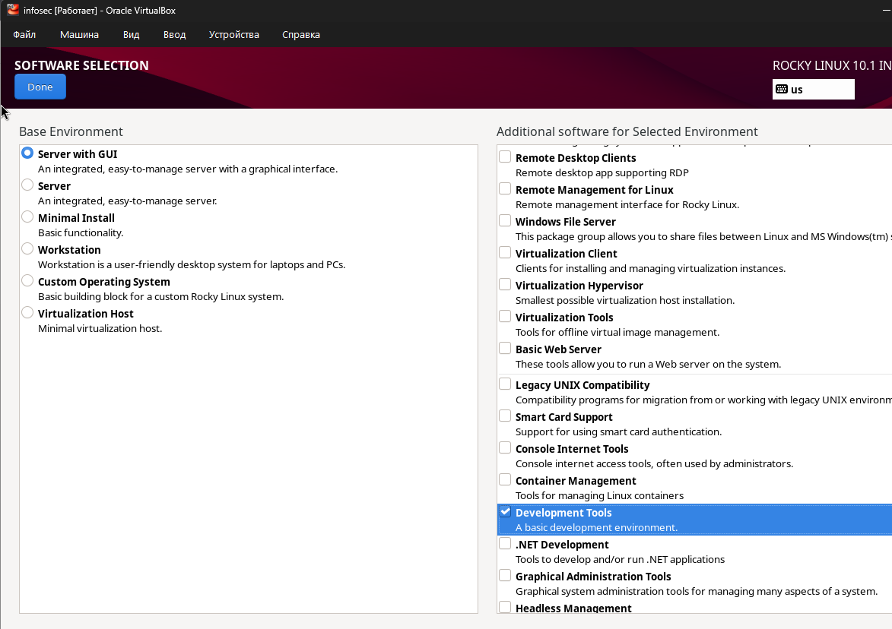{#fig:009 width=70%}

Проверяю сеть, указываю имя узла в соответствии с соглашением об именовании (рис. 8).

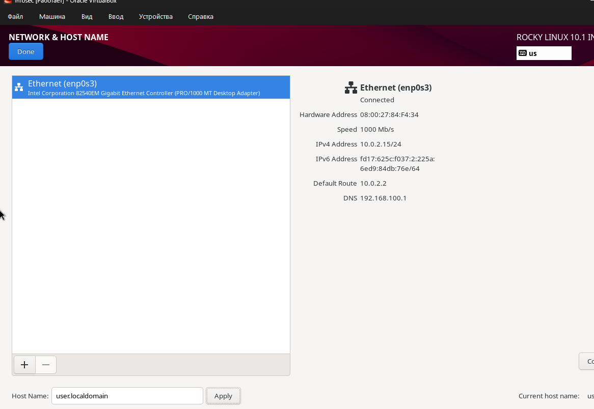{#fig:008 width=70%}

Установка успешно выполнена (рис. 10)
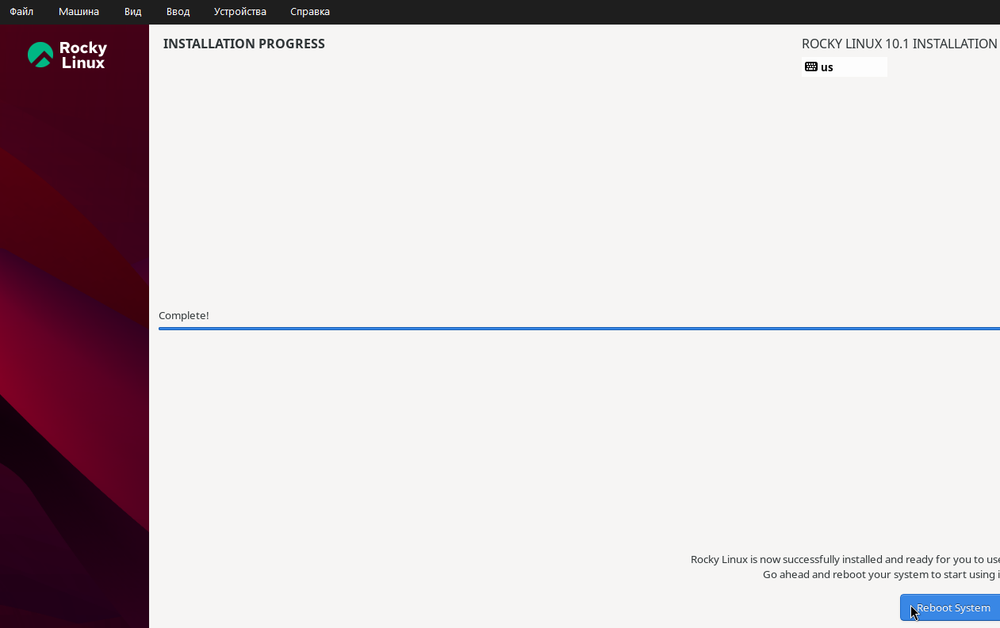{#fig:010 width=70%}

После заврешения установки образ диска сам пропадет из носителей 

# Выполнение дополнительного задания

Версия ядра 

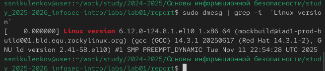{#fig:011 width=70%}

Частота процессора 

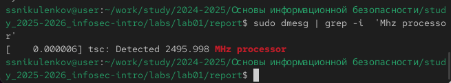{#fig:012 width=70%}

Модель процессора Intel Core i5

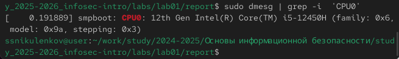{#fig:013 width=70%}

Доступно 260860 Кб из 2096696 Кб (р

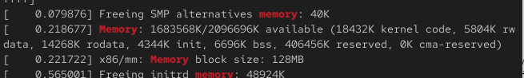{#fig:014 width=70%}

Обнаруженный гипервизор типа KVM 

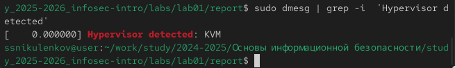{#fig:015 width=70%}

sudo fdisk -l показывает тип файловой системы, типа Linux, Linux LVM 

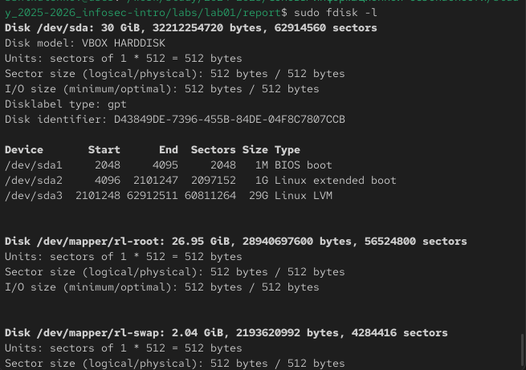{#fig:016 width=70%}

# Ответы на контрольные вопросы

1. Учетная запись содержит необходимые для идентификации пользователя при подключении к системе данные, а так же информацию для авторизации и учета: системного имени (user name) (оно может содержать только латинские буквы и знак нижнее подчеркивание, еще оно должно быть уникальным), идентификатор пользователя (UID) (уникальный идентификатор пользователя в системе, целое положительное число), идентификатор группы (CID) (группа, к к-рой относится пользователь. Она, как минимум, одна, по умолчанию - одна), полное имя (full name) (Могут быть ФИО), домашний каталог (home directory) (каталог, в к-рый попадает пользователь после входа в систему и в к-ром хранятся его данные), начальная оболочка (login shell) (командная оболочка, к-рая запускается при входе в систему).

2. Для получения справки по команде: <команда> —help; для перемещения по файловой системе - cd; для просмотра содержимого каталога - ls; для определения объёма каталога - du <имя каталога>; для создания / удаления каталогов - mkdir/rmdir; для создания / удаления файлов - touch/rm; для задания определённых прав на файл / каталог - chmod; для просмотра истории команд - history

3. Файловая система - это порядок, определяющий способ организации и хранения и именования данных на различных носителях информации. Примеры: FAT32 представляет собой пространство, разделенное на три части: олна область для служебных структур, форма указателей в виде таблиц и зона для хранения самих файлов. ext3/ext4 - журналируемая файловая система, используемая в основном в ОС с ядром Linux.

4. С помощью команды df, введя ее в терминале. Это утилита, которая показывает список всех файловых систем по именам устройств, сообщает их размер и данные о памяти. Также посмотреть подмонтированные файловые системы можно с помощью утилиты mount.

5. Чтобы удалить зависший процесс, вначале мы должны узнать, какой у него id: используем команду ps. Далее в терминале вводим команду kill < id процесса >. Или можно использовать утилиту killall, что "убьет" все процессы, которые есть в данный момент, для этого не нужно знать id процесса. 

# Выводы

Я приобрел практические навыки
установки операционной системы на виртуальную машину, настройки ми-
нимально необходимых для дальнейшей работы сервисов.

# Список литературы{.unnumbered}

::: {#refs}
:::
