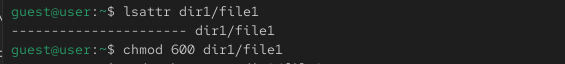
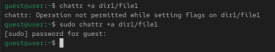
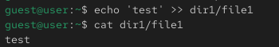
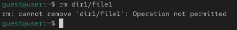
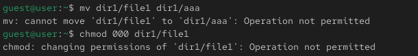
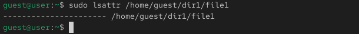
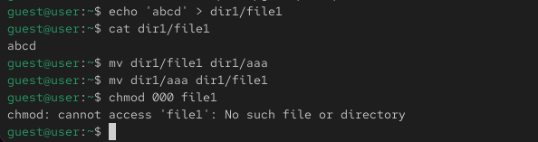
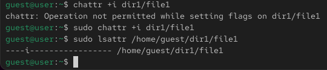
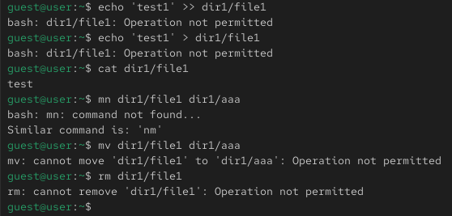

---
## Author
author:
  name: Никуленков Степан Сергеевич
  degrees: DSc
  orcid: 0000-0002-0877-7063
  email: 1132246744@rudn.ru
  affiliation:
    - name: Российский университет дружбы народов
      country: Российская Федерация
      postal-code: 117198
      city: Москва
      address: ул. Миклухо-Маклая, д. 6
## Title
title: Презентация по лабораторной работе №4
subtitle: ''
license: CC BY
date: today
date-format: "YYYY-MM-DD" # Example: 2025-09-06
---

# Информация

## Докладчик

:::::::::::::: {.columns align=center}
::: {.column width="70%"}

  * Никуленков Степан Сергеевич
  * Студент группы НКАбд-03-24 
  * Российский университет дружбы народов им. П. Лумумбы
:::
::: {.column width="30%"}

:::
::::::::::::::

## Цель работы

Получение практических навыков работы в консоли с расширенными
атрибутами файлов

## Выполнение лабораторной работы

1. От имени пользователя guest, созданного в прошлых лабораторных работах, определяю расширенные атрибуты файлa `/home/guest/dir1/file1`.Изменяю права доступа для файла home/guest/dir1/file1 с помощью chmod 600

{#fig:001 width=70%}

2. Пробую установить на файл /home/guest/dir1/file1 расширен-
ный атрибут a от имени пользователя guest, в ответ получаю отказ от выполнения операции Устанавливаю расширенные права уже от имени суперпользователя, теперь нет отказа от выполнения операции

{#fig:002 width=70%}

3. От пользователя guest проверяю правильность установки атрибута 

{#fig:003 width=70%}

4. Выполняю **дозапись** в файл с помощью `echo 'test' >> dir1/file1`, далее выполняю чтение файла, убеждаюсь, что дозапись была выполнена

{#fig:004 width=70%}

5. Пробую удалить файл, получаю отказ от выполнения действия.

{#fig:005 width=70%}

То же самое получаю при попытке переименовать файл

Получаю отказ от выполнения при попытке установить другие права доступа

{#fig:006 width=70%}

6. Снимаю расширенные атрибуты с файла

{#fig:007 width=70%}

Проверяю ранее не удавшиеся действия: чтение, переименование, изменение прав доступа. Теперь все из этого выполняется 

{#fig:008 width=70%}

7. Пытаюсь добавить расширенный атрибут i от имени пользователя guest, как и раньше, получаю отказ 
Добавляю расширенный атрибут i от имени суперпользователя, теперь все выполнено верно 

{#fig:009 width=70%}

Пытаюсь записать в файл, дозаписать, переименовать или удалить, ничего из этого сделать нельзя

{#fig:010 width=70%}

## Выводы

В результате выполнения работы вы повысили свои навыки использования интерфейса командой строки (CLI), познакомились на примерах с тем,
как используются основные и расширенные атрибуты при разграничении
доступа. Имели возможность связать теорию дискреционного разделения
доступа (дискреционная политика безопасности) с её реализацией на практике в ОС Linux. Опробовали действие на практике расширенных атрибутов «а» и «i»

## Список литературы. Библиография

[0] Методические материалы курса

[1] Права доступа: https://codechick.io/tutorials/unix-linux/unix-linux-permissions

[2] Расширенные атрибуты: https://ru.manpages.org/xattr/7
